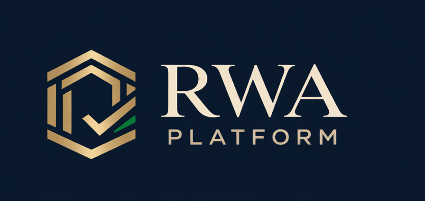
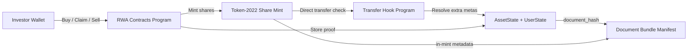

<p align="center">
  
</p>

<p align="center">
  
  
  
</p>

<p align="center"><strong>Compliance-aware RWA on Solana.</strong></p>

RWA Platform is a Solana MVP for tokenized real-world assets with whitelist-gated investing, Token-2022 transfer restrictions, and on-chain document verification.

## Problem

Retail investors are locked out of yield-bearing real assets by high minimum tickets, manual paperwork, and weak trust rails.

Most hackathon "RWA" demos stop at a landing page or a metadata JSON. They do not prove:

- who is allowed to hold the asset
- how ownership is represented on-chain
- how transfers are restricted
- how the token maps back to a document package

## Solution

RWA Platform turns one real asset into a compliance-aware token flow on Solana:

- each asset gets its own Token-2022 share mint
- investors are approved per asset through a whitelist
- `buy_shares`, `claim_yield`, and `instant_sell` run through live Anchor programs
- Token-2022 `TransferHook` enforces transfer policy at the token layer
- `document_hash` is stored on-chain and cross-checked against in-mint metadata

Current demo asset: `Astana Coffee Shop`

## Why Solana?

This product needs more than "fast and cheap."

- `Token-2022` gives us asset-specific share mints, metadata extensions, and transfer hooks in the token standard itself.
- `TransferHook` lets us enforce compliance at the point of transfer instead of hoping app logic is always respected.
- Low fees matter because the demo models micro-scale investor actions: buy, claim, and exit should be cheap enough to repeat.
- Solana UX makes the jury flow realistic: connect wallet, sign, verify, inspect addresses, and see state update live.

## Live Demo Today

The repo already contains a working investor demo flow:

- connect Phantom on `localnet`
- self-whitelist in demo mode
- buy Token-2022 shares
- watch yield accrue live
- verify the asset against the document hash
- claim yield or instant sell

## Stack

- Solana / Agave `2.3.0`
- Anchor `0.32.1`
- `anchor-spl`
- Token-2022
- SPL Transfer Hook Interface
- Next.js 16 + TypeScript + Tailwind
- Phantom wallet integration

## Architecture



More implementation detail lives in [docs/ARCHITECTURE.md](docs/ARCHITECTURE.md).

## Repo Structure

- `contracts/rwa-contracts` - Anchor programs, tests, IDLs, and seeding scripts
- `app` - localnet investor demo UI
- `docs` - logo and architecture notes

## Quick Start

### 1. Start local validator

```bash
solana-test-validator -r
```

### 2. Build and seed the contracts

```bash
cd contracts/rwa-contracts
solana config set --url http://127.0.0.1:8899
solana airdrop 10
anchor build
anchor deploy
ANCHOR_PROVIDER_URL=http://127.0.0.1:8899 ANCHOR_WALLET=~/.config/solana/id.json yarn seed:devnet
```

### 3. Fund your Phantom test wallet

```bash
solana airdrop 5 YOUR_PHANTOM_ADDRESS --url http://127.0.0.1:8899
```

### 4. Run the frontend

```bash
cd app
cp .env.example .env.local
npm install
npm run dev
```

Use this local env:

```bash
NEXT_PUBLIC_SOLANA_NETWORK=localnet
NEXT_PUBLIC_SOLANA_RPC_URL=http://127.0.0.1:8899
NEXT_PUBLIC_RWA_ASSET_ID=0
RWA_ADMIN_KEYPAIR_PATH=/home/user/.config/solana/id.json
```

Then open [http://localhost:3000](http://localhost:3000).

## What The Jury Should Look At

- one real asset shown with real storefront photos
- wallet connect and whitelist gating
- a live `Buy shares` transaction
- yield accruing on screen
- `Hash matches on-chain` in the verification section
- Token-2022 compliance messaging around direct transfer restriction

## Roadmap

- deploy the full demo flow to devnet
- add Blink-based purchase entrypoints
- support stablecoin-denominated payouts
- expand from single-asset demo to multi-asset marketplace browsing
- replace demo whitelist with production KYC/KYB integrations

## Resources

- Demo UI: localnet app in `app`
- Pitch video: to be attached before final submission
- Slides: to be attached before final submission
